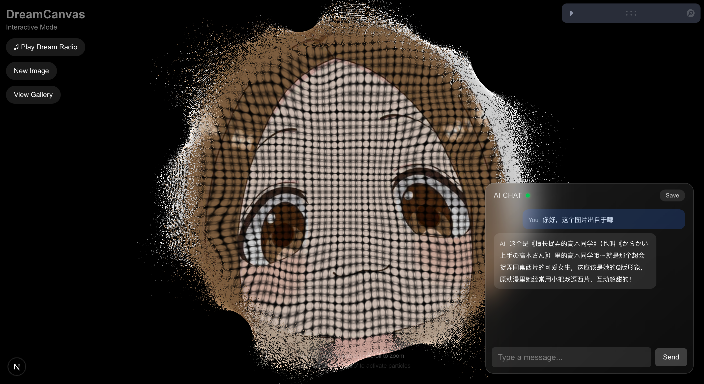
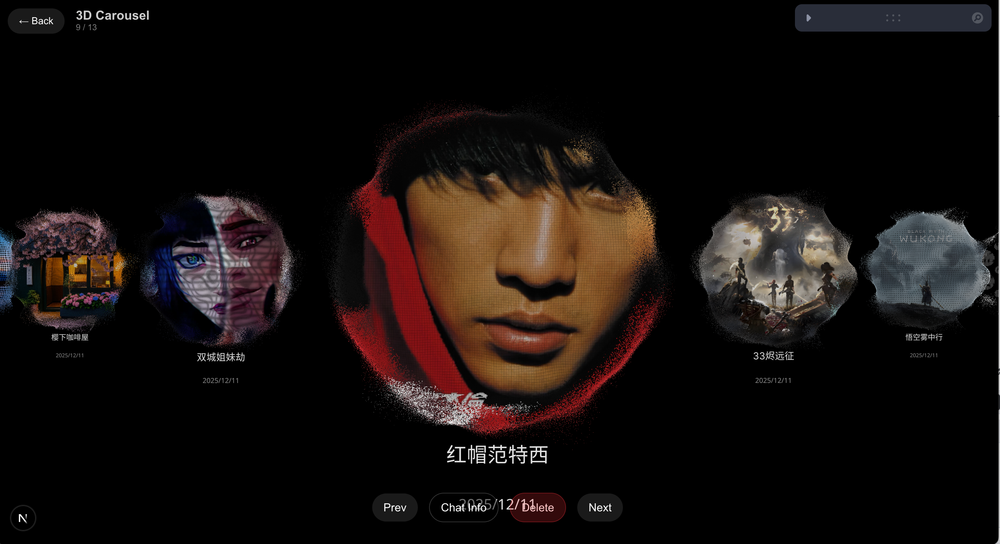

# 🌌 DreamCanvas (梦幻画布)

> **Transform your images into an interactive 3D particle universe.**
>
> 这是一个基于 Next.js 和 Three.js 构建的交互式 3D 视觉项目。它不仅能将你上传的图片转化为由无数粒子构成的 3D 梦幻星空，还集成了环境氛围音乐（Dream Radio）与 AI 智能对话功能，为你提供沉浸式的视听与交互体验。

---

## ✨ 核心特性 (Features)

- 🎨 **3D 粒子化图像 (Image Particles)**
  - 上传任意图片，通过 `@react-three/fiber` 瞬间将其打散为 3D 粒子。
  - 支持鼠标悬浮交互，粒子会随着鼠标移动产生流体般的物理排斥效果。
  - 支持鼠标滚轮缩放与全方位拖拽视角。

- 🎵 **梦幻电台 & 音频可视化 (Dream Radio & Audio Reactive)**
  - 内置氛围音乐电台（Ambient Music）。
  - 音乐播放时，粒子会随着音乐的节奏和音量大小产生动态的律动和呼吸效果。

- 🤖 **AI 伴游对话 (AI Chat Companion)**
  - 接入 Doubao 大模型 API。
  - 在你沉浸于 3D 画布时，可以通过右侧悬浮聊天框与 AI 助手交流，并伴有优雅的字幕覆盖效果（Subtitle Overlay）。

- 🖼️ **画廊模式 (Gallery)**
  - 将你喜欢的作品保存至本地画廊，随时回顾你的专属画布。

---

## 🖼 展示效果 (Showcase)

### 主界面 / 图片上传



### 本地画廊



---

## 🛠️ 技术栈 (Tech Stack)

- **框架**: [Next.js 15](https://nextjs.org/) (App Router) + [React 19](https://react.dev/)
- **3D 渲染**: [Three.js](https://threejs.org/) + [@react-three/fiber](https://docs.pmnd.rs/react-three-fiber/) + [@react-three/drei](https://github.com/pmndrs/drei)
- **样式**: [Tailwind CSS 4](https://tailwindcss.com/)
- **状态管理**: Zustand / Context API + `idb` (IndexedDB 离线存储)
- **AI 接口**: 兼容 OpenAI 格式的 Doubao API 接入

---

## 🚀 快速启动 (Getting Started)

由于项目代码包为了精简体积，**不包含** `node_modules` 依赖文件夹。在首次运行前，您需要先安装依赖。

### 1. 克隆项目与安装依赖

请确保您的电脑上已安装 Node.js。在终端中运行以下命令：

```bash
git clone https://github.com/your-username/dream-canvas.git
cd dream-canvas

# 安装依赖
npm install
# 或使用 yarn / pnpm
yarn install
```

### 2. 配置环境变量

本项目依赖 AI 服务（如豆包大模型），请在根目录下创建一个 `.env.local` 文件，并填入您的 API 配置：

```env
# .env.local
DOUBAO_API_KEY=your_api_key_here
DOUBAO_MODEL_ID=your_model_id_here
```

### 3. 启动开发服务器

安装完成后，运行以下命令启动项目：

```bash
npm run dev
```

### 4. 访问项目

打开浏览器访问 [http://localhost:3000](http://localhost:3000) 即可进入梦幻画布。

---

## 🤝 贡献与反馈 (Contributing)

欢迎提交 Issue 和 Pull Request！如果你喜欢这个项目，别忘了给它点个 **Star ⭐️** ！

## 📄 开源协议 (License)

[MIT License](./LICENSE)
